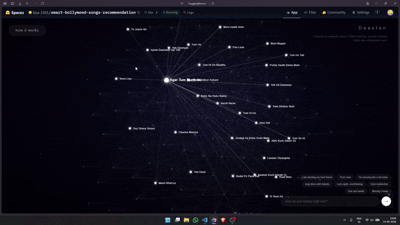
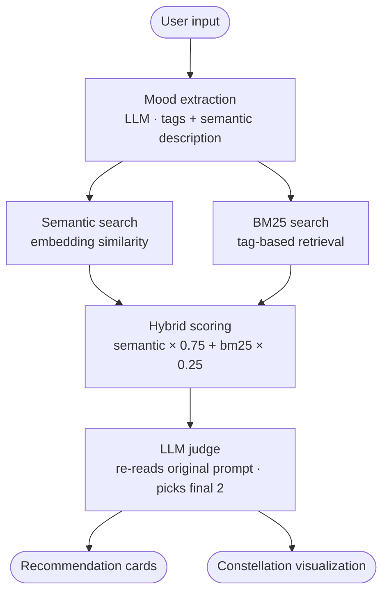

# Smart Bollywood Song Recommender

Spotify knows you listened to Tum Hi Ho 47 times last month. It does not know you played it 44 of those times because you were procrastinating, not because you were in love.

Algorithms see patterns. They don't see you.

This project does something different. You describe your exact moment : in one line, in English, Hinglish and it finds the Bollywood song where one specific lyric proves it understood you. Not your mood. Not your genre. Your moment.


---

## Live demo

🔗 [https://huggingface.co/spaces/Ilaa-1505/smart-bollywood-songs-recommendation](https://huggingface.co/spaces/Ilaa-1505/smart-bollywood-songs-recommendation)
> If the Space is sleeping, it may take ~30 seconds to wake up on first visit.
---

## Demo
 
[](https://youtu.be/CIXeNfe6_8I)
 
*Click the gif to watch the demo*

---

## How it works

You type one line. That's it.

Under the hood, two LLMs, a hybrid search system, and a 3D constellation visualization work together to find not just a matching song, but the right song for the specific thing you're feeling right now.




---

## What's inside

### Mood extraction

Your input goes to an LLM that reads between the lines. It doesn't label your mood with a single word. It generates 3 grounded emotional tags and a restrained semantic description of what you're actually feeling, without overclaiming.

- Input: "sad and lonely tonight"
- Tags: loneliness, quiet despair, solitude
- Emotion: a deep sense of isolation and disconnection, preoccupied with being alone


---

### Dual retrieval

Two search engines run in parallel against a library of song emotional summaries.

Vector search finds songs that feel similar. BM25 finds songs that match on exact tags. They disagree often, which is why you need both.


---

### Hybrid scoring

Results are blended with a weighted formula.

```
final_score = semantic_score * 0.75 + bm25_score * 0.25
```

Semantic relevance carries most of the weight because feelings are fuzzy, not keyword shaped. The top 3 candidates move forward.


---

### LLM judge

The top candidates go to a second LLM. This one reads your original words again, not just the extracted tags. It understands the emotional intent underneath, selects the 2 songs that actually fit, and writes grounded reasoning tied to real lyrics.

> 

---

### Constellation visualization

Songs live as nodes in a 3D star field. Emotional similarity becomes edges. Recommended songs glow. The camera drifts cinematically.

It shows you the emotional landscape of the entire library and where your moment lands inside it.

> 

---

### Recommendation cards

Each result comes with the emotional reason it was picked, album art, mood tags, and a Spotify link. Not just "this is a good match." Why this song, for this exact moment.

> 

---

## Pipeline

```
input → LLM mood extraction → semantic search + BM25 → hybrid scoring → LLM judge → response
```

- **Mood extraction** — LLM generates emotional tags and a semantic description
- **Vector search** — embedding similarity against song emotional summaries
- **BM25** — symbolic tag based retrieval
- **Hybrid fusion** — semantic * 0.75 + bm25 * 0.25
- **LLM judge** — second model selects final 2 songs and writes reasoning
- **Constellation** — React 3D graph, songs as nodes, similarity as edges
- **Backend** — FastAPI serves the API and the built React app from /dist

---

## Stack

- **Backend** — FastAPI
- **LLM** — two stage pipeline, one for extraction, one for judging
- **Search** — sentence transformers for embeddings, BM25 for symbolic retrieval
- **Frontend** — React, Three.js for the constellation
- **Music data** — Spotify API for album art and playback links

---

## Run it yourself

```
git clone https://github.com/your-username/smart-bollywood-song-recommender
cd smart-bollywood-song-recommender
pip install -r requirements.txt
```

Set up your environment:

```
echo "OPENAI_API_KEY=your_key_here" > .env
echo "SPOTIFY_CLIENT_ID=your_id_here" >> .env
echo "SPOTIFY_CLIENT_SECRET=your_secret_here" >> .env
```

Build the frontend:

```
cd frontend
npm install
npm run build
```

Run:

```
uvicorn main:app --reload
```

The app is served at `http://localhost:8000`

---

## Things I learned building this

- BM25 and semantic search disagree a lot more than expected. a song about missing someone scores high on vector search but BM25 misses it entirely if the tags don't match. hybrid scoring genuinely earns its complexity
- The LLM judge changes the final result almost every time. the top ranked candidate from hybrid scoring is not always the right pick once the model reads the original prompt again
- Temperature in mood extraction matters. too high and the tags get dramatic and ungrounded. too low and everything collapses to the same 3 words

---

## What's next

- Expand the song library beyond the current index
- Let users save moments and revisit what song found them that night
- Support for other regional music catalogues
